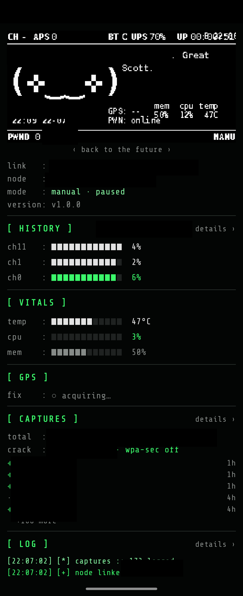
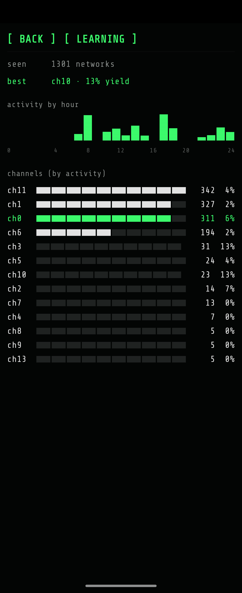
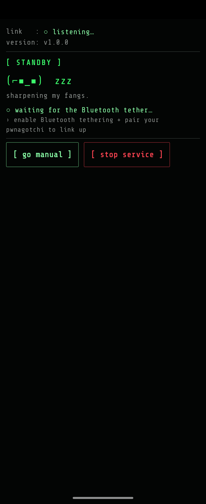

# PwnCompanion

Android companion app for [Pwnagotchi](https://github.com/jayofelony/pwnagotchi). Connects to the Pwnagotchi over Bluetooth PAN, receives live screen captures, provides GPS location, and runs a fully on-device, deterministic "AI" that reacts to WiFi hunting events in real time — and, crucially, **advises where to hunt next** so the device catches more handshakes.

The whole UI is a single monospace **terminal console** (phosphor-green on black, ASCII block-bars, scanlines) — no Material chrome, everything on one scrolling screen.

### What it is, in plain terms

A [Pwnagotchi](https://github.com/jayofelony/pwnagotchi) is a pocket gadget (usually a Raspberry Pi Zero) that passively sniffs Wi-Fi and collects **WPA handshakes** for security research, showing its status as a moody ASCII face on a tiny e-ink screen. On its own it's **headless, has no GPS, and runs on a Pi too weak** to do anything clever with what it captures.

**PwnCompanion turns your phone into its screen and its brain.** It:
- **mirrors** the pet's live e-ink display on your phone;
- **geotags** every captured handshake and plots them on a **map**;
- **decides where to hunt next** — a phone-side advisor ranks Wi-Fi channels by real yield + live client density and steers the device there, so it catches *more* handshakes;
- gives the pet a genuine **personality voice** — a curated, franchise-flavored corpus with live data woven in, spliced onto the pwnagotchi's own e-ink screen;
- closes the loop by **cracking** captured handshakes — server-side via wpa-sec, or **on-phone** (offline, native-accelerated PMKID) — and showing the recovered passwords.

The guiding idea: **move the thinking to the phone** (which has compute, GPS, and storage) and leave the Pi lean, just hunting. See ["Why the brain lives on the phone"](docs/HOW_IT_WORKS.md#why-the-brain-lives-on-the-phone-not-the-pi).

**Requires Android 10+ (API 29)** on an arm64 device, plus a [Pwnagotchi](https://github.com/jayofelony/pwnagotchi) running the [`bt-tether`](https://github.com/wsvdmeer/pwnagotchi-plugins) + `pwn-companion.py` plugins. The `pwn-companion` plugin is now **available in pwnstore** for one-tap install (see [GETTING_STARTED.md](GETTING_STARTED.md)).

> ⚠️ **Responsible use & no warranty.** PwnCompanion is a companion for authorized Wi-Fi security research and education, paired with a [Pwnagotchi](https://github.com/jayofelony/pwnagotchi). Capturing handshakes, sending deauthentication frames, and cracking passwords may be illegal without permission — only use it on networks you **own or have explicit authorization to test**. You are responsible for complying with your local laws. The software is provided **as-is, without warranty of any kind — use at your own risk** (see GPL-3.0 §15–16). Licensed under **GPL-3.0** (see [`LICENSE`](LICENSE)).

> ⚙️ **Setup is required — the app does nothing on its own.** It only works paired with a [Pwnagotchi](https://github.com/jayofelony/pwnagotchi) running **both** the [`bt-tether`](https://github.com/wsvdmeer/pwnagotchi-plugins) and `pwn-companion.py` plugins, plus the plugin's Python dependency (`sudo apt install python3-websockets` — on Bookworm; `pip3` is blocked by PEP 668). **Follow [GETTING_STARTED.md](GETTING_STARTED.md) first** — it walks both halves (Pi plugins + deps, then the phone app) end to end. Skipping it means the app just sits on the standby screen with nothing to connect to.

## Screenshots

  
  
  

*Left: the live console — the pwnagotchi's mirrored e-ink face (with the current franchise shown in the console header, `[ VOICE ]  ‹world›` — a green label on the left, the franchise name on the right), vitals, per-channel history, captures, and log. Middle: the `[ history ]` learning detail — channels by activity + activity-by-hour. Right: the `[ standby ]` screen when nothing's linked. (SSIDs / node name / IP redacted for publishing.)*

---

## How It Works (30-Second Summary)

1. Enable **Bluetooth Tethering** on Android (Settings → Connections → Mobile Hotspot and Tethering → Bluetooth Tethering)
2. Pair and connect the Pwnagotchi via Bluetooth — Android creates a `bt-pan`/`bnep0` network interface
3. The app detects the interface, starts a **WebSocket server** on the phone's bt-pan IP (port 8081)
4. The app broadcasts **UDP announcements** (port 8888) so the Pwnagotchi plugin discovers the server
5. The Pwnagotchi plugin connects via WebSocket and starts sending screen captures, WiFi events, and GPS requests
6. The app sends GPS back, the AI reacts to every handshake capture / deauth / network discovery

### What syncs (both directions)

Everything rides the one Bluetooth PAN link. The phone also shares its **internet** to the Pi over that link (via `bt-tether`), which is what lets wpa-sec upload/download.

**Pwnagotchi → App** (what the pet streams up):

| | Message | What it carries |
|---|---|---|
| 🖥 Screen | `image` | the live e-ink frame (~1/s) |
| ℹ️ Status | `status` | device name, IP, current **mood**, mode (AUTO/MANUAL), and **wpa-sec** status (enabled + service reachable) |
| 📶 WiFi events | `network_event` | handshake captured / association / deauth / idle — each tagged with the real **channel + BSSID** |
| 📊 Per-channel stats | `autotune_stats` | handshakes / deauths / associations + peak AP & client density per channel (the steering ground truth) |
| 🌡 Telemetry | `device_telemetry` | temperature, CPU, memory, RL **reward**, AP/client/peer counts, mood counters — full per-epoch in AUTO, plus a lightweight temp/cpu/mem push every ~12 s in any mode |
| 📍 Capture log | `capture_history` | geolocated handshakes (paired with `.gps.json`), each graded for **crackability** (eapol/pmkid/partial) with its hashcat-**22000 hash** (for on-phone cracking), plus the raw file count |
| 🔓 Cracked | `cracked` | wpa-sec results (BSSID → password), on connect + every ~2 min |
| 🙂 Emotions | (in `status`) | the device's own mood events — grateful / bored / sad / angry / excited / lonely |

**App → Pwnagotchi** (what the phone sends down):

| | Message | What it does |
|---|---|---|
| 📡 Discovery | UDP `announcement` | broadcasts `ws://phone-ip:8081` every 5 s so the plugin finds the app |
| 📍 GPS | `gps` | the phone's fix (lat/lon/accuracy/altitude) on request (~5 s) → geotags captures + feeds location learning (the Pi has no GPS of its own) |
| 🎯 Channel steering | `set_channel_priority` | the advisor's top channels → bettercap recon, every 45 s **while hunting** (AUTO only), soft + reversible |
| 🎛 Auto-tuning | `set_param` | clamped `min_rssi` / `ap_ttl` / `sta_ttl` / `recon_time` / hop timing — re-implements the removed RL param-tuner on the phone |
| 🗣 Device voice | `set_voice_pool` | fresh in-character lines per pwnagotchi voice category; the plugin speaks them in the e-ink bubble instead of the stock repeating quips (falls back to stock when disconnected) |
| ⏯ Mode control | `restart_auto` / `restart_manual` | flip the pet between hunting and paused |

### The connection, in detail

Everything rides **one Bluetooth PAN link** with a **single WebSocket** on top — no cloud, no pairing server, no fixed IPs to configure:

1. **Transport (Bluetooth PAN).** You enable Bluetooth tethering on the phone and pair the Pwnagotchi; Android's `bt-tether` brings up a `bt-pan` / `bnep0` interface with a private IP (typically `192.168.44.x`). Because it's *tethering*, the phone also **shares its internet** to the Pi over that same link — which is what lets wpa-sec upload/download.
2. **The phone is the server.** The app runs an embedded **WebSocket server** bound to its `bnep0` IP on **port 8081**. The phone is the server (not the Pi) on purpose: it owns the stable listening endpoint, the compute, and the storage, so the Pi stays a thin client that just streams and obeys. If the phone disconnects, the Pi simply keeps hunting on its own — no dependency.
3. **Discovery (no hardcoded IPs).** The `bnep0` address Android hands out isn't predictable, so the app **broadcasts a UDP announcement on port 8888 every 5 s** carrying its `ws://<bnep0-ip>:8081` URL. The plugin listens for that beacon and dials the WebSocket — so it just works whatever IP comes up, with nothing to configure.
4. **The session.** Once connected, both ends exchange **JSON messages tagged by a `type` field** (the two tables above). On connect the plugin sends its `capture_history` backlog + status; the app seeds cracked/alert state silently so a reconnect never floods you with notifications.
5. **Resilience (the BT radio is flaky).** The Pi Zero shares one 2.4 GHz radio between Wi-Fi and Bluetooth, so the tether can wedge. The link is hardened for it: **WebSocket keepalive** pings catch a silently-dropped tether in seconds, every send is **timeout-bounded** so a wedged socket never blocks, disconnect teardown is **non-blocking** so a drop can't freeze the Pi's main loop, and the app keeps re-broadcasting UDP so the plugin **auto-reconnects** the moment the link returns. The phone side is kept alive by foreground services so Android won't kill it mid-session. (See [Troubleshooting](docs/TROUBLESHOOTING.md#troubleshooting--connection-drops--needing-frequent-reboots) for the hardware limitation this works around.)

That client/server split *is* the design: it's what lets the **brain live on the phone** — the Pi transmits and captures, the phone does the thinking (bandit steering, the tuner, personality, cracking) and sends only small, reversible hints back down. See [Why the brain lives on the phone](docs/HOW_IT_WORKS.md#why-the-brain-lives-on-the-phone-not-the-pi).

---

## Features

- **Live e-ink mirror** — the pwnagotchi's screen streamed to the phone (~1/s), with light-face auto-invert so bright e-ink themes stay readable on the dark console.
- **GPS geotagging + map** — every captured handshake is tagged with the phone's location and plotted on a pixel map (dark CARTO tiles, ASCII fallback offline).
- **Deauth / hunt advisor** — a phone-side UCB1 bandit ranks Wi-Fi channels by real yield + live client density, flags untapped targets, and steers the device toward where the handshakes are.
- **On-phone + wpa-sec cracking** — crack captured handshakes on the phone itself (offline, native-accelerated PMKID) or server-side via wpa-sec, with recovered passwords shown inline.
- **Franchise voice** — a curated, franchise-flavored personality corpus (21 cult-film / game worlds) spoken on the pet's own e-ink, with browsable in-app line lists; no language model, fully deterministic.
- **Emergent personality** — no fixed mood picker; the disposition emerges from live events, the device's own emotions, and a learned baseline persisted across restarts.
- **Vitals / telemetry** — live block-bar gauges for temperature, CPU, memory, the RL reward, and AP / client / peer density.
- **Capture history** — a searchable, geolocated log of every handshake, graded for crackability.
- **Notifications** — a glanceable live-pet notification (e-ink face + stats) plus alerts on link-up and newly cracked networks.
- **Terminal UI** — a single monospace phosphor-green console (ASCII block-bars, scanlines), no Material chrome, everything on one screen.
- **All on device** — no analytics, no crash reporting, no cloud sync; data lives on your phone and travels only to your Pi over the local link.

## Compatibility

Built and **tested on the [jayofelony](https://github.com/jayofelony/pwnagotchi) fork** (with the [`bt-tether` plugin](https://github.com/wsvdmeer/pwnagotchi-plugins) as the transport). Other pwnagotchi forks are **untested** — the app is fork-agnostic (it only speaks WebSocket/UDP to the plugin) and the plugin uses standard pwnagotchi APIs and degrades gracefully, so it may work elsewhere, but jayofelony is the only version I've verified.

## Documentation

- **[Getting Started](GETTING_STARTED.md)** — full setup, both halves end to end (Pi plugins + deps, then the phone app).
- **[How It Works](docs/HOW_IT_WORKS.md)** — the emergent AI personality, the deauth/hunt advisor, why the brain lives on the phone, and the plugin hooks.
- **[Features](docs/FEATURES.md)** — capture history, handshake cracking (wpa-sec + on-phone), device vitals, notifications, and look & feel.
- **[Troubleshooting](docs/TROUBLESHOOTING.md)** — connection drops / needing frequent reboots, and the privacy model.

## License

**GPL-3.0** — see [`LICENSE`](LICENSE). You may use, modify, and redistribute this software under the terms of the GNU General Public License v3.0; derivative works must remain open-source under the same license.

Built on / credits: [Pwnagotchi (jayofelony fork)](https://github.com/jayofelony/pwnagotchi).

### Third-party assets

- **Share Tech Mono** — the terminal font (bundled as `res/font/terminal_mono.ttf`), © Carrois Apostrophe, licensed under the [SIL Open Font License 1.1](licenses/ShareTechMono-OFL.txt).
- **Map tiles** — © [OpenStreetMap](https://www.openstreetmap.org/copyright) contributors, © [CARTO](https://carto.com/attributions) (dark basemap, fetched at runtime, cached on-device).
- **Cracking wordlist** — pwncrack `default.gz` (fetched at runtime for on-phone cracking; not redistributed here).

### Trademarks & parody

The pet's voice riffs on cult films and games (Evil Dead, Star Wars, The Matrix / Mr. Robot, Harry Potter, Terminator, Tron, Jurassic Park, Alien, RoboCop, Blade Runner, WarGames, Hackers, Portal, Predator, 2001: A Space Odyssey, Cyberpunk 2077, System Shock, Mad Max, Ghostbusters, Back to the Future, The Thing). PwnCompanion is an **unofficial, non-commercial parody/homage** — it is **not affiliated with, endorsed by, or sponsored by** any of those rights holders. All titles, characters, and quoted phrases are the trademarks and copyrights of their respective owners, referenced here for parody and commentary only.

> Reminder: authorized / educational use only — see the responsible-use note at the top.
